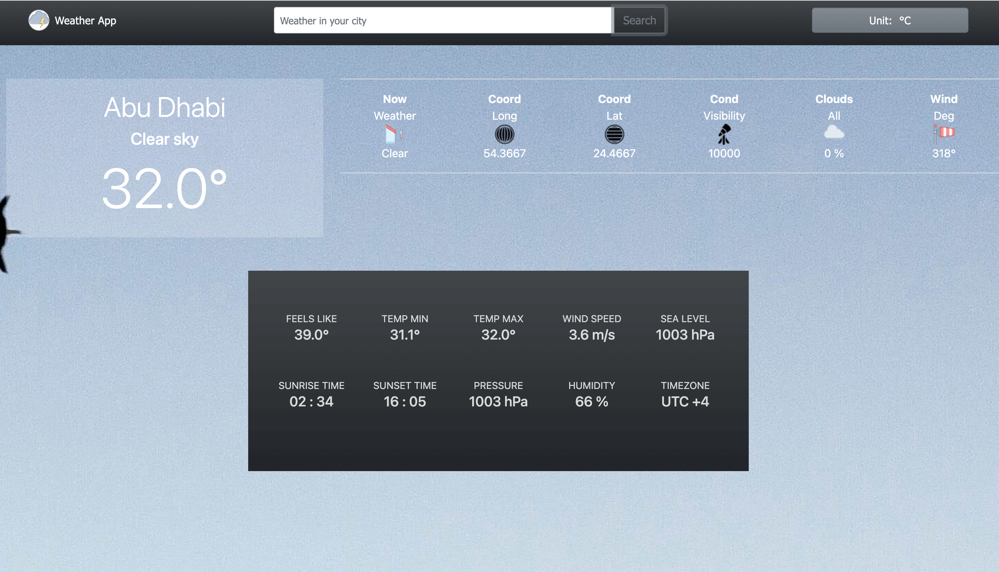

## Weather App


## Live Link
Visit the [Weather App](https://george-swift.github.io/weather-app/) to get started

### Objectives:
- Working with APIs
- Using ES7 Async functions and Promises
- Functional programming
- Principles of Object-oriented design
- Code organization with ES6 modules in Javascript
- Using Webpack for compiling Javascript modules
- DOM manipulation

## Features
The weather app renders a detailed meteorological report of the weather in a user's city or desired location. The application uses
the Open Weather API to provide requested data. To get a weather report, simply fill in the search field in the navbar with a city
name. By design, the temperature units default to Celsius. However, users can toggle the temperature unit to Fahrenheit from the 
`Unit` button, top-right in the navbar. To view other weather data, slide right on the widgets section. If weather information is 
unavailable for a given city, a modal will appear with respective information.

## Prerequisites
- Internet Connection
- Git GUI
- An Integrated Development Environment
- Chrome and Firefox or Safari. Internet Explorer is not supported.
- Node Package Manager [(NPM)](https://docs.npmjs.com/about-npm)

## Tools/Built With
- JavaScript ES6, ES7
- Webpack
- Bootstrap
- HTML5/CSS3
- NPM

## Getting Started
- To get started with the app, clone this project by running `git clone https://github.com/george-swift/weather-app.git`
- Sign up or sign in [Open Weather](https://openweathermap.org/api) to get your API key
- Create a `.env` file in the root directory with the following code
```
  WEATHER_URL=api.openweathermap.org/data/2.5/weather
  API_KEY='INSERT YOUR API KEY HERE'

```
- Run `npm install` to install the needed packages and dependencies
- A development tool is included in the npm script. Run `npm run start` to fire up a local server with live reloading.
- If not already redirected, visit `http://localhost:8080/` in your browser to use the Weather App with dev server.
- To terminate the server, enter `Ctrl + C` in your terminal

## Authors

👤 &nbsp; **Ubong George**
- LinkedIn: [Ubong George](https://www.linkedin.com/in/ubong-itok)
- Twitter: [@\_\_pragmaticdev](https://twitter.com/__pragmaticdev)
- GitHub: [@george-swift](https://github.com/george-swift)

## Acknowledgments

- [Unsplash creatives](https://unsplash.com/) for aesthetic background images
- [Icons 8](https://icons8.com/) for icons used in widgets section
- [Microverse](https://www.microverse.org)
- [Odin Project](https://www.theodinproject.com/paths/full-stack-javascript/courses/javascript/lessons/todo-list)

## Show your support

Leave a :star:️ &nbsp; if you like this project!

## License

Available as open source under the terms of the [MIT License](https://opensource.org/licenses/MIT).